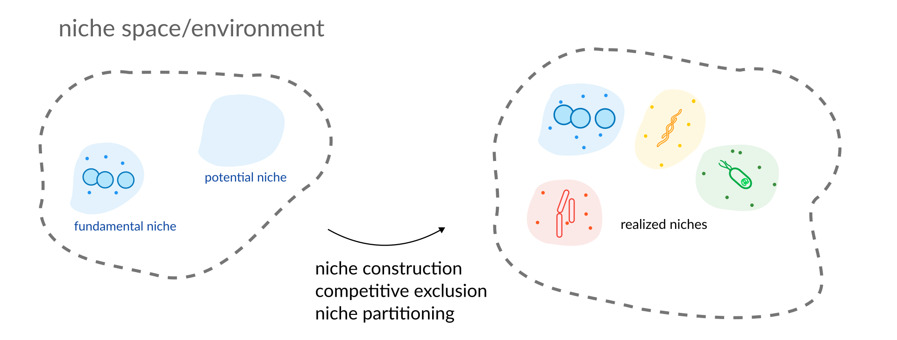

+++
keywords = ["life", "career", "lab"]
date = "2023-12-14T12:00:00"
hero = "daniel-j-schwarz-graz-unsplash.jpg"
title = "Some personal news..."
+++

It still feels a bit unreal to write this but here it comes. After almost 6 incredible years
at the Institute for Systems Biology in Seattle I will join the faculty of the Medical University
of Graz early 2024 as an Assistant Professor in Computational Microbiome Science.

My lab will be part of The Diagnostic and [Research Institute](https://hygiene.medunigraz.at/en/)
of Hygiene, Microbiology and Environmental Medicine and will operate within the Austrian
Cluster of Excellence ["Microbiomes Drive Planetary Health"](https://microplanet.at). I am
excited (giddy to be honest) to join the MedUni and the amazing students, faculty and administration
there.

I will try my best to have a positive impact on the students, research, and culture at the MedUni and to
collaborate with many of you in the future.

---

In very broad terms my team and I will research the **niche dynamics in microbial communities**.
The trillions of microorganisms living in our gut (as well as the 70 gigatons carbon of microbes on
the planet) perform a complex ballet of metabolic interactions between each other and their
environment, giving rise to a myriad of biotransformations. We will study the flexibility of microorganisms
in adapting their nutrient needs and their interactions with surrounding microbes in varying environments
and how this may impact health and disease.

Questions my lab will work on are:

- Can we use genomic information to **mechanistically predict metabolite uptake and
  production** in a specific microbiome and environmental context?
- What is the **impact of the environments on the microbial niche space** and how does the
  microbiome interact and change the host-derived environment?
- Can **niche dynamics predict engraftment** and priority effects during the colonization by
  pathogens or probiotics?

All this while using the huge wealth of resources available that will allows us to leverage
a breadth of strategies ranging from metagenomics and metabolomics to culturomics.

I am looking forward to my time back in Europe after a decade-long hiatus and hope to get to
know as much of the local research environment as I possibly can soon.

🦠+💻=💓