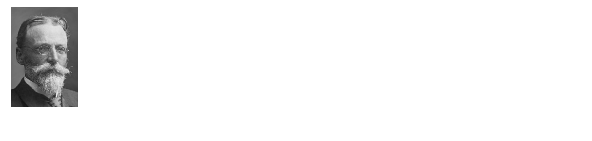
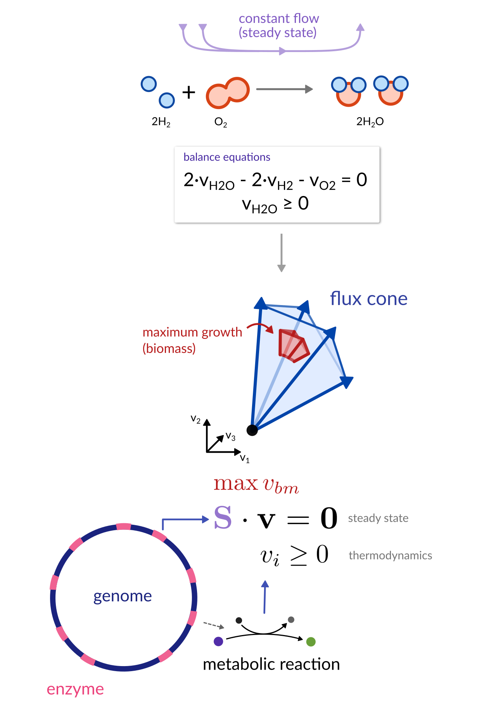
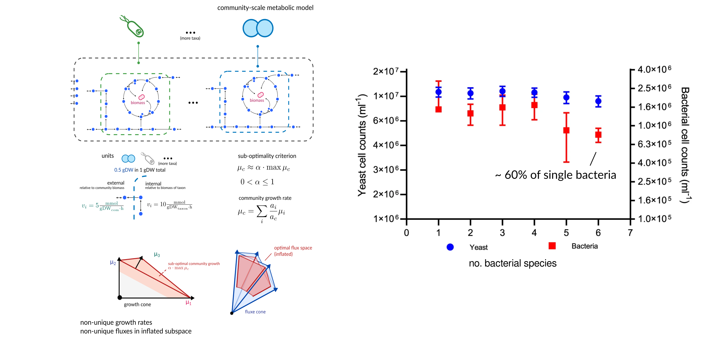
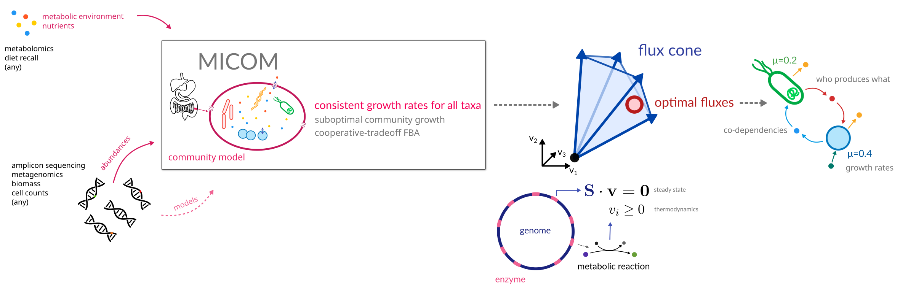
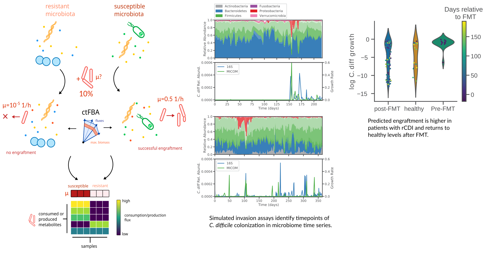
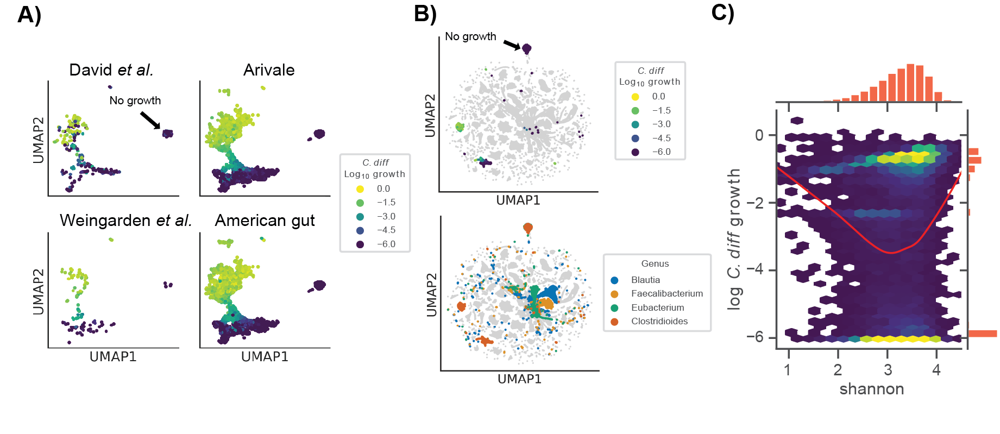
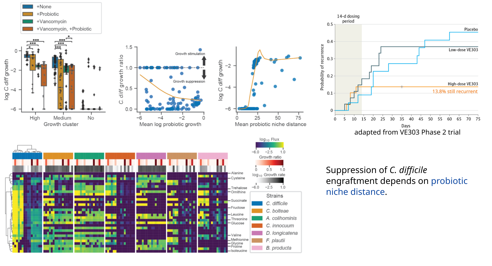
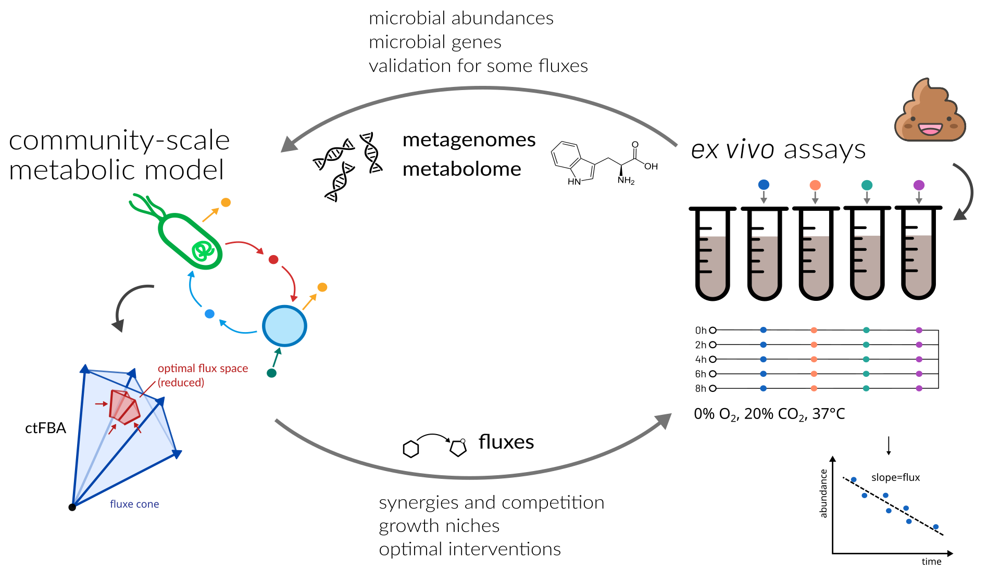

<!-- .slide: data-background="assets/backdrop.webp" class="dark" -->

# Personalized engraftment prediction with metabolic models of the human gut microbiota

### Christian Diener, Gibbons Lab

  

<a href="https://creativecommons.org/licenses/by-sa/4.0/"><i class="bx bx-cctv"></i>CC BY-SA 4.0</a>
<a href="https://gibbons.isbscience.org/"><i class="bx bxs-home"></i>cdiener.com</a>
<a href="https://github.com/gibbons-lab"><i class="bx bxl-github"></i>gibbons-lab</a>
<a href="https://twitter.com/thaasophobia"><i class="bx bxl-twitter"></i>@thaasophobia</a>
<a href="https://mstdn.science/@thaasophobia"><i class="bx bxl-mastodon"></i>@thaasophobia</a>

---

<!-- .slide: data-background="var(--primary)" class="dark" -->

## The gut microbiome - not so new after all

  

We have *examined and disentangled* many of the 38 trillion bacteria living in and on us.

But how do we *engineer* microbial communities?

Ed Jong, I contain multitudes 
Zeng, Xing, et al. 2022 http://dx.doi.org/10.1016/j.cell.2022.07.020 
Gibbons et al. 2022 https://doi.org/10.1093/advances/nmac075

---

<!-- .slide: data-background="var(--primary)" class="dark" -->

## Do we know enough of the rules to play the game?

  

Explaining the metabolic behavior of microbial communities through
mechanisms by using *Flux Balance Analysis (FBA)*.

---

## Quantifying Metabolism - Fluxes

<video width="45%" autoplay loop>
  <source src="assets/fluxes.mp4" type="video/mp4">
</video>

video courtesy of [S. Nayyak](https://twitter.com/Na_y_ak) and [J. Iwasa](https://twitter.com/janetiwasa)

---

## Community-scale metabolic models - pretty rowdy

Diener et al. 2023, https://doi.org/10.1128/msystems.01270-22

---

That makes full community-scale metabolic models *usable*.

But even curated metabolic models for many species do not capture the full complexity of
metabolism. So are those models also *useful*?

How do we *validate* the model predictions?

---

## Is it better than the status quo?

186 metagenome samples from Swedish and Danish individuals. 
Manually curated metabolic models from the AGORA database. 
Import fluxes based on an average European diet.

Really good tool for *studying interventions*.

Diener et al. 2020, https://doi.org/10.1128/mSystems.00606-19 
Korem, Suez, Zeevi, Weinberger et al. 2015, https://dx.doi.org/10.1126%2Fscience.aac4812 
Magnúsdóttir et al., https://doi.org/10.1038/nbt.3703

---

## Personalized engraftment prediction of <i>C. difficile</i>

*Alex Carr* (Gibbons Lab) 
preprint at https://doi.org/10.1101/2023.04.28.538771

---

## A pathogen enabled by niche flexibility?

---

## Identifies the mechanistic basis for the VE303 probiotic consortium

Dsouza et al. 2022, https://doi.org/10.1016/j.chom.2022.03.016 
Louie et al., 2023, https://doi.org/10.1001/jama.2023.4314

---

## Summary

Community-scale metabolic models can be used to rationally predict interventions in the human gut microbiome.

Can be leveraged to predict dietary interventions and pathogen invasion potential.

Likely helpful for large-scale screening but validation is key (<i>ex vivo</i> fermentations :heart:).

---

<!-- .slide: data-background="assets/backdrop_last.jpg" -->

# Thanks! :smile:

### ISB

**Sean Gibbons** 
Alex Carr 
Nick Bohmann 
Kat Ramos Sarmiento 
Nitin Baliga 

### UW-Madison

Ophelia Venturelli 

### Funding

NIH 
Washington Research Foundation

